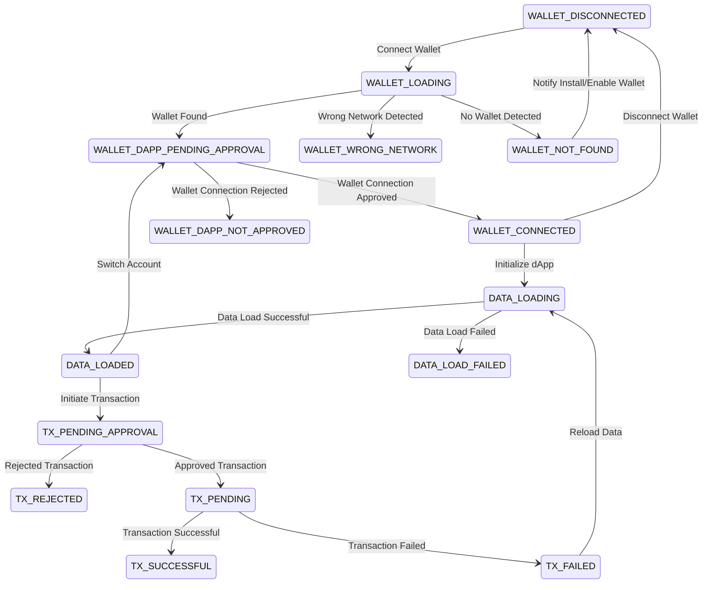

# React App with Starknet Cairo1



## Installation and Setup

## Clone Cairo1 Hardhat Project

```bash
git clone https://github.com/sustia-llc/cairo1-hardhat.git
```

Follow the instructions in the README.md file to compile the Cairo1 contract, start the devnet with docker, and run the test to deploy the contract.

## Run the app

### `npm start`

Runs the app in the development mode.\
Open [http://localhost:3000](http://localhost:3000) to view it in the browser.

The page will reload if you make edits.\
You will also see any lint errors in the console.

### Install Argent X or Braavos Wallet

Install the Argent X or Braavos Wallet as an extension in your browser. Switch to the Localhost 5050 network. Create a new "standard account".

## Interact with the App

Click the "connect" button and allow the app to connect to http://localhost:3000

### `npm test`

Launches the test runner in the interactive watch mode.\
See the section about [running tests](https://facebook.github.io/create-react-app/docs/running-tests) for more information.

### `npm run build`

Builds the app for production to the `build` folder.\
It correctly bundles React in production mode and optimizes the build for the best performance.

The build is minified and the filenames include the hashes.\
Your app is ready to be deployed!

See the section about [deployment](https://facebook.github.io/create-react-app/docs/deployment) for more information.

### Install Chrome Extensions
https://chromewebstore.google.com/detail/redux-devtools/lmhkpmbekcpmknklioeibfkpmmfibljd