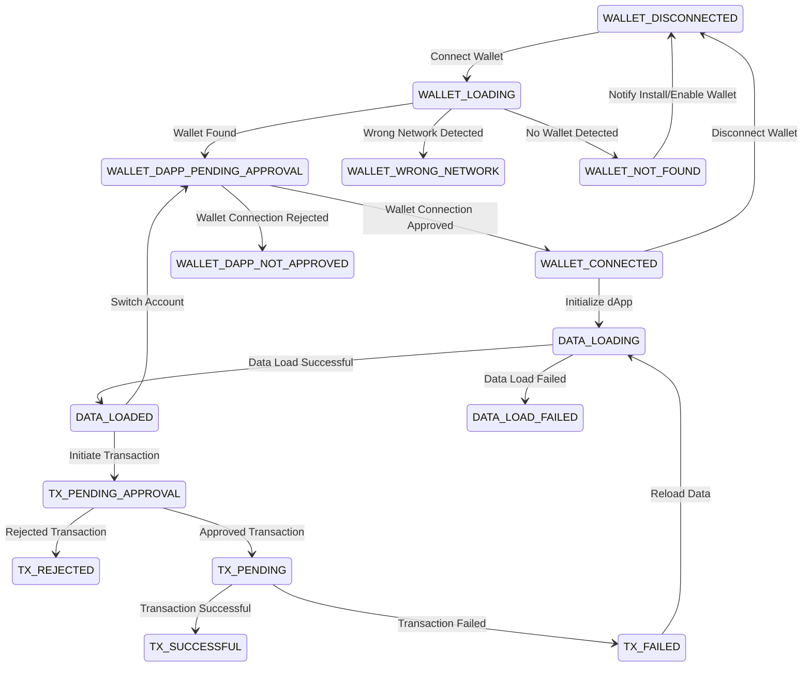

# React App with Starknet Cairo1


```mermaid
stateDiagram-v2
    state WALLET_DISCONNECTED
    state WALLET_LOADING
    state WALLET_DAPP_PENDING_APPROVAL
    state WALLET_DAPP_NOT_APPROVED
    state WALLET_CONNECTED
    state WALLET_WRONG_NETWORK
    state WALLET_NOT_FOUND
    state DATA_LOADING
    state DATA_LOADED
    state DATA_LOAD_FAILED
    state TX_PENDING_APPROVAL
    state TX_REJECTED
    state TX_PENDING
    state TX_FAILED
    state TX_SUCCESSFUL

    WALLET_DISCONNECTED --> WALLET_LOADING: Connect Wallet
    WALLET_LOADING --> WALLET_DAPP_PENDING_APPROVAL: Wallet Found
    WALLET_DAPP_PENDING_APPROVAL --> WALLET_CONNECTED: Wallet Connection Approved
    WALLET_DAPP_PENDING_APPROVAL --> WALLET_DAPP_NOT_APPROVED: Wallet Connection Rejected
    WALLET_LOADING --> WALLET_WRONG_NETWORK: Wrong Network Detected
    WALLET_LOADING --> WALLET_NOT_FOUND: No Wallet Detected

    WALLET_CONNECTED --> DATA_LOADING: Initialize dApp
    DATA_LOADING --> DATA_LOADED: Data Load Successful
    DATA_LOADING --> DATA_LOAD_FAILED: Data Load Failed
    DATA_LOADED --> WALLET_DAPP_PENDING_APPROVAL: Switch Account
    DATA_LOADED --> TX_PENDING_APPROVAL: Initiate Transaction
    TX_PENDING_APPROVAL --> TX_REJECTED: Rejected Transaction
    TX_PENDING_APPROVAL --> TX_PENDING: Approved Transaction
    TX_PENDING --> TX_SUCCESSFUL: Transaction Successful
    TX_PENDING --> TX_FAILED: Transaction Failed
    TX_FAILED --> DATA_LOADING: Reload Data

    WALLET_CONNECTED --> WALLET_DISCONNECTED: Disconnect Wallet
    WALLET_NOT_FOUND --> WALLET_DISCONNECTED: Notify Install/Enable Wallet
```

## Installation and Setup

## Clone Cairo1 Hardhat Project

```bash
git clone https://github.com/sustia-llc/cairo1-hardhat.git
```

Follow the instructions in the README.md file to compile the Cairo1 contract, start the devnet with docker, and run the test to deploy the contract.

## Run the app

### `npm start`

Runs the app in the development mode.\
Open [http://localhost:3000](http://localhost:3000) to view it in the browser.

### Install Argent X or Braavos Wallet

Install the Argent X or Braavos Wallet as an extension in your browser. Switch to the Localhost 5050 network. Create a new "standard account".

## Interact with the App

Click the "connect" button and allow the app to connect to http://localhost:3000

### `npm test`

Launches the test runner in the interactive watch mode.\
See the section about [running tests](https://facebook.github.io/create-react-app/docs/running-tests) for more information.

### `npm run build`

Builds the app for production to the `build` folder.\
It correctly bundles React in production mode and optimizes the build for the best performance.

The build is minified and the filenames include the hashes.\
Your app is ready to be deployed!

See the section about [deployment](https://facebook.github.io/create-react-app/docs/deployment) for more information.

### `npm run eject`

**Note: this is a one-way operation. Once you `eject`, you can’t go back!**

If you aren’t satisfied with the build tool and configuration choices, you can `eject` at any time. This command will remove the single build dependency from your project.

Instead, it will copy all the configuration files and the transitive dependencies (webpack, Babel, ESLint, etc) right into your project so you have full control over them. All of the commands except `eject` will still work, but they will point to the copied scripts so you can tweak them. At this point you’re on your own.

You don’t have to ever use `eject`. The curated feature set is suitable for small and middle deployments, and you shouldn’t feel obligated to use this feature. However we understand that this tool wouldn’t be useful if you couldn’t customize it when you are ready for it.

## Learn More

You can learn more in the [Create React App documentation](https://facebook.github.io/create-react-app/docs/getting-started).

To learn React, check out the [React documentation](https://reactjs.org/).

## Create App

```bash
npx create-react-app starknet-redux-typescript --template redux-typescript
```

## Add starknet.js

```bash
npm install starknet@next
```

## Add MUI

```bash
npm install @mui/material @mui/lab @emotion/react @emotion/styled
```

##

TODO Link to USECASES.md
